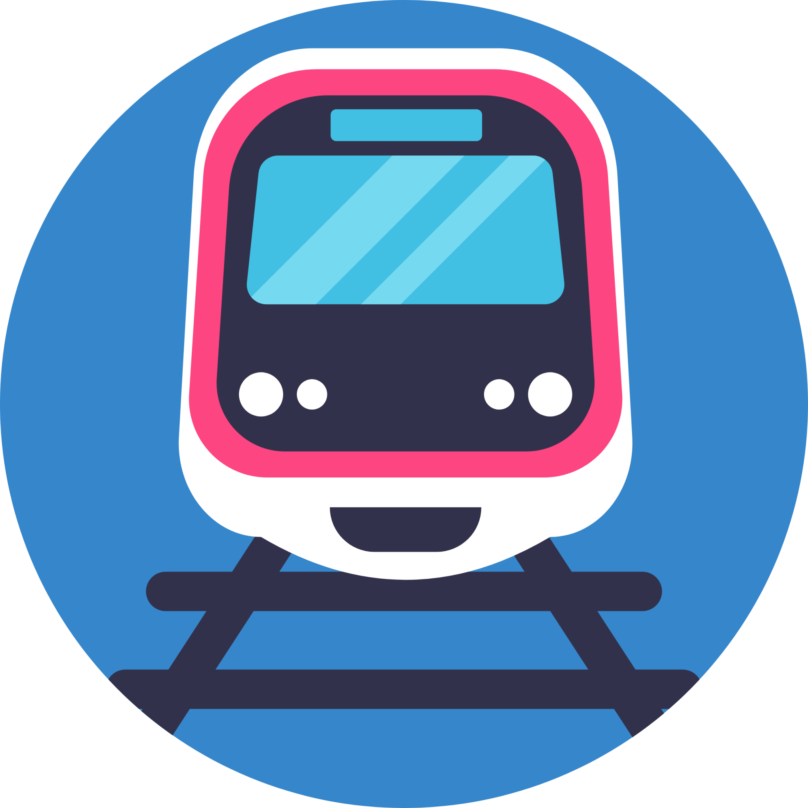
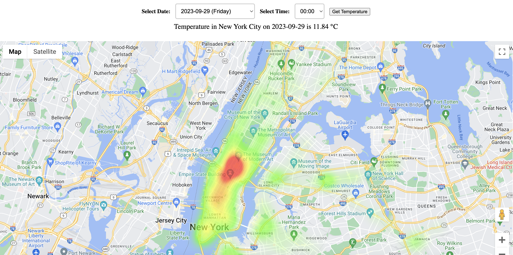
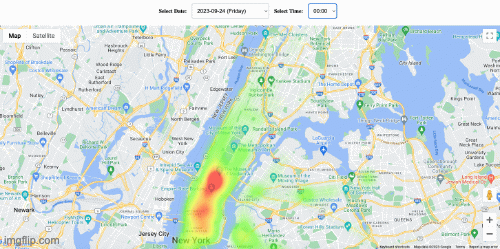
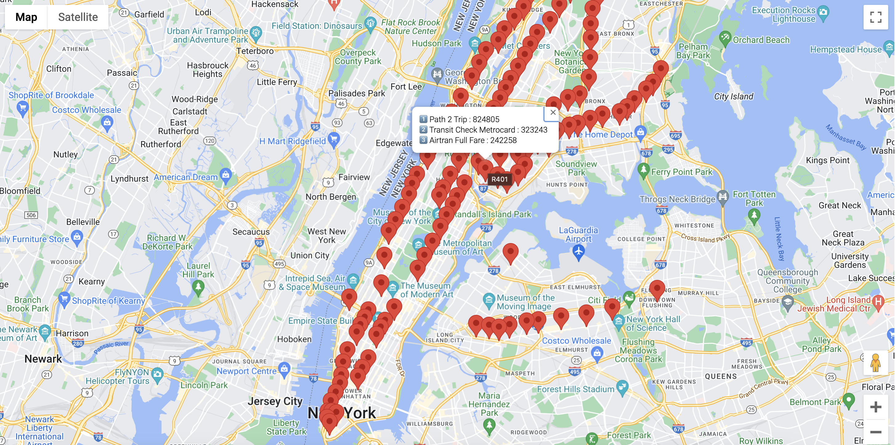
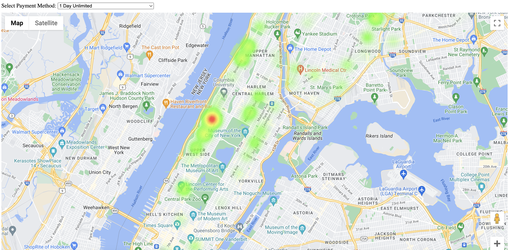

# **MTA Commute Pal** - Columbia Data Science Society Datathon Fall 2023

# Visualization Links

### 01. [Popular Payment Marker Map](https://6522672083e18d0ec8facd3d--funny-beignet-c1dda2.netlify.app/)

### 02. [Metro Card Payment Heatmap](https://652276617dda7a199bba71aa--coruscating-choux-fa808e.netlify.app/)

### Subway Commute made Better.

---

## A Preview of What Commute Pal Is:

## Landing page:

## Heatmap of 24 hours of live Rider Count

## Marker Map of Most Popular Payment Methods at a Station

## The problem MTA Commute Pal solves

> The New York City subway system is one of the busiest in the world, with over 5 million
> riders per day. However, it is also one of the most congested, with delays and overcrowding a
> common occurrence. This is due in part to the difficulty of predicting periods of increased
> ridership, which can lead to overcrowding and delays.

## Solution

> We propose to develop a system that combines the MTA dataset, geographical patterns of
> temperature, different card types stacking at each station, and traffic footfall to predict
> periods of increased ridership. This system will use machine learning to identify patterns in
> the data that can be used to forecast future ridership levels.

## Features offered by MTA Commute Pal

- ### **Reduced congestion**
  - By predicting periods of increased ridership, the MTA can run
    more trains at those times to help prevent overcrowding.
- ### **Improved service to handle footfall prediction**
  - By understanding how ridership
    patterns vary over time and space, the MTA can improve its service planning and
    delivery (effective labor resources)
- ### **Increased customer satisfaction**
  - By reducing congestion and improving service, our
    system will make the subway a more pleasant and reliable experience for riders. One
    trip at a time.

## Technology Stack and Dependencies

- **Time Series Prediction**
- **Pandas**
- **Seaborn**
- **Numpy**
- **Python**
- **HTML**
- **CSS**
- **JavaScript**

# Thank You!

<h1 align="center"> Contributors </h1>
<table align="center">
<tr align="center">
<td>
<strong>Shikhar Johri</strong>

</td>
<td>
<strong>Shivam Shekhar</strong>

</td>
</tr>
</table>
<table align="center">
<tr align="center">
<td>
<strong>
Mohsin Chougale</strong>

</td>

</tr>
</table>
